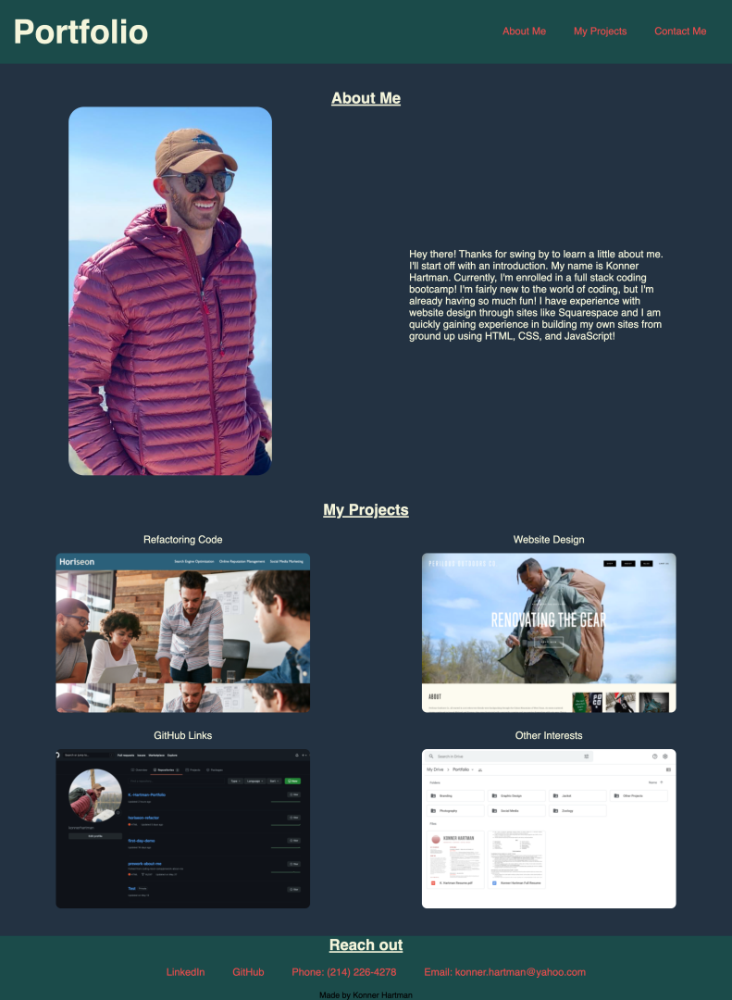

# K.-Hartman-Portfolio

## DESCRIPTION
I recently updated this code to showcase an updated portfolio. While doing this I utilized the CSS framework, BootStrap, FontAwesome for the icons, and JavaScript for the functionality. 

Issues that I ran into while updating this were BootStrap  blocking specific styling features I wanted to add and JavaScript functions not working as I desired. I was able to find ways to work around these issues while staying within BootStrap and JavaScript. Bootstrap documentation was heavily referenced.

This portfolio will continue to be updated with new features, as it is one I will continue to use in my professional career. 

## Table of Contents
- [Description](#description)
- [Usage](#usage)
- [Resources](#resources)
- [Links](#links)
- [Screen Captures](#screencapture)
- [Questions](#questions)

## USAGE
This portfolio will serve as my personal portfolio as I complete my coding bootcamp and into my career. It will give potential employers and colleagues a look into who I am, my competencies, and my coding abilities. 

## RESOURCES
1. https://getbootstrap.com/
2. https://fontawesome.com/
3. https://www.w3schools.com/
4. https://stackoverflow.com

## LINKS
Link to page:
https://konnerhartman.github.io/K.-Hartman-Portfolio/

## SCREENCAPTURE
Previous design    

Current design

## QUESTIONS
For any questions, you can reach me at:
 
GitHub: https://github.com/konnerhartman
 
Email: konner.hartman@yahoo.com